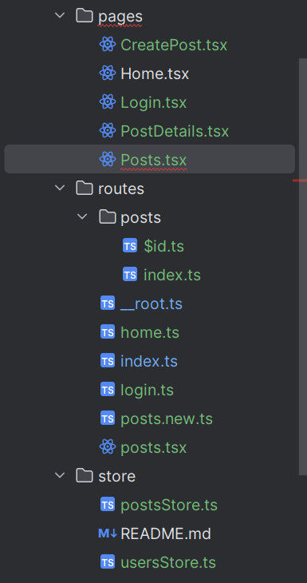
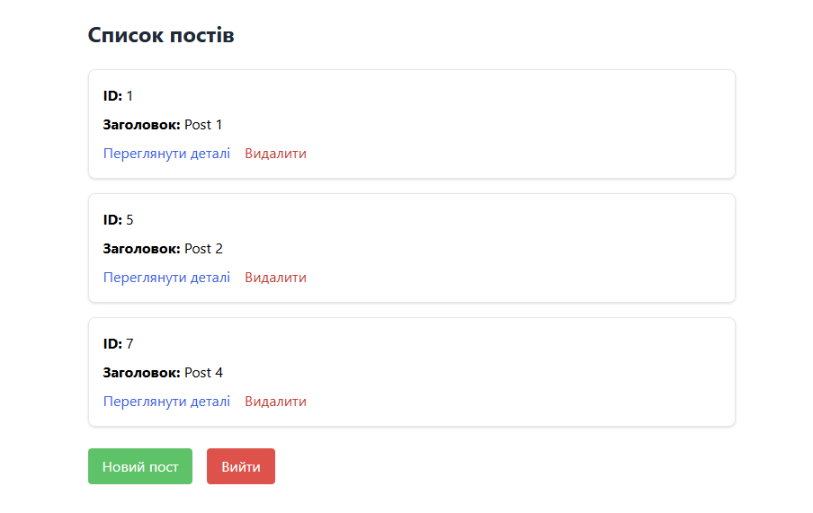
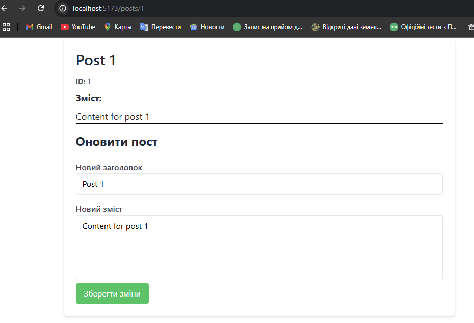
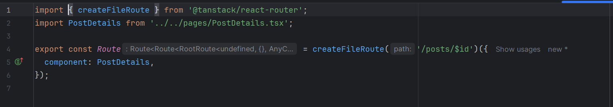
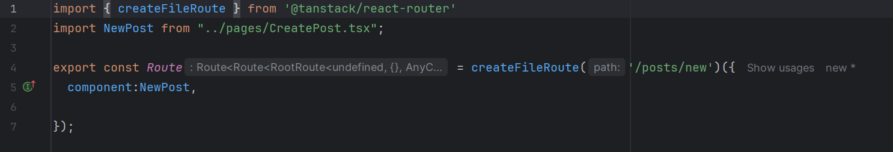
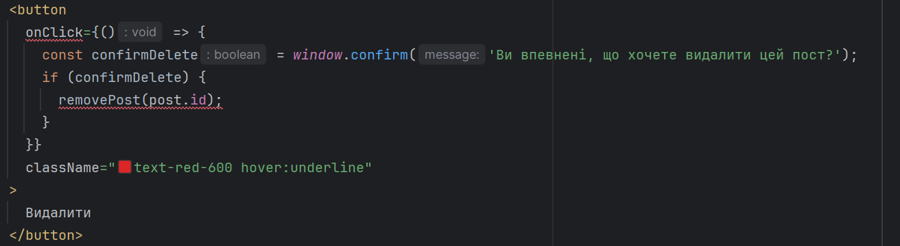
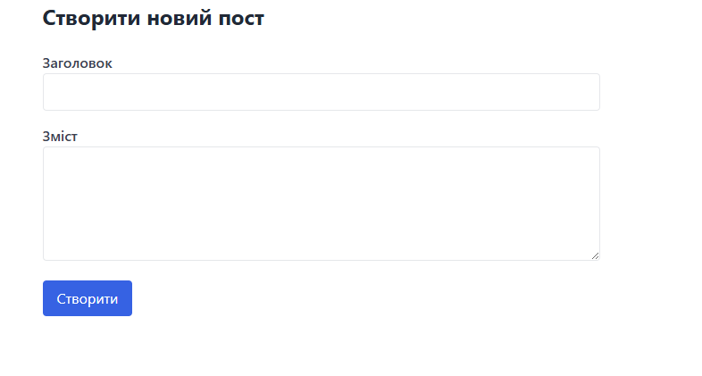

<h2>1. Сторінка колекції екземплярів сутності (/posts)</h2>

-   Реалізувати рендеринг списку всіх доступних екземплярів сутності.
-   Для кожного елемента відображати основну інформацію (ключові поля).
-   Передбачити можливість переходу на сторінку конкретного екземпляра (/posts/:id).
-   Додати кнопку "Створити новий екземпляр", яка веде на маршрут /posts/new.
-   Реалізувати можливість видалення елемента з колекції (з підтвердженням дії).

<h2>2. Сторінка окремого екземпляра сутності (/posts/:id або /posts/new)</h2>

-   У режимі перегляду (/posts/:id) реалізувати:
    -   відображення повної інформації про екземпляр;
    -   можливість редагування (форма з полями);
    -   кнопку для збереження змін (Update).
-   У режимі створення (/posts/new) реалізувати:
    -   форму з порожніми полями для введення нових даних;
    -   кнопку для збереження нового екземпляра (Create).

    

    
