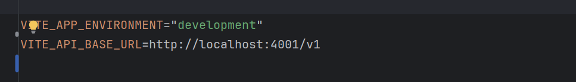
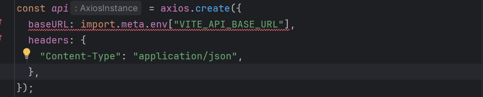
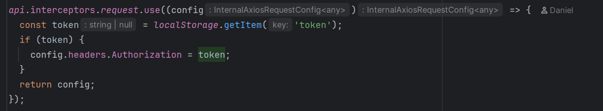
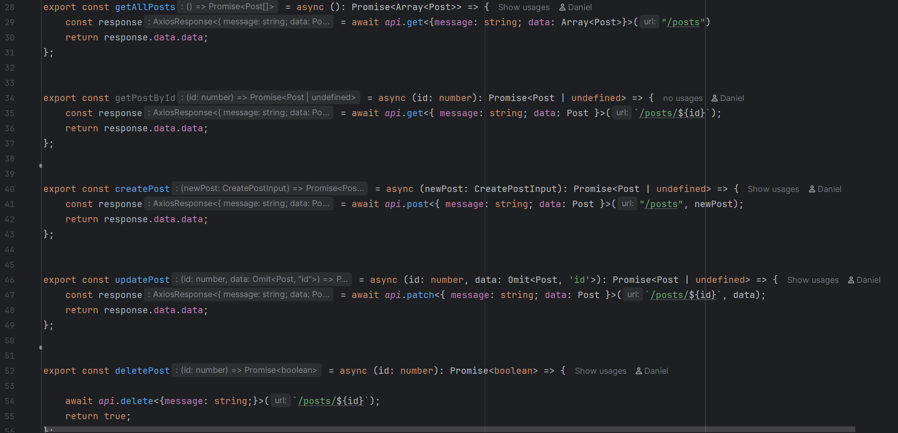
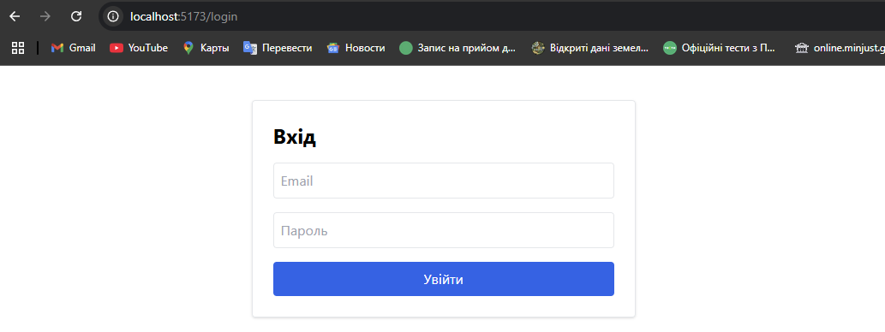
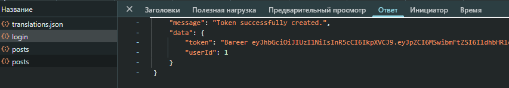
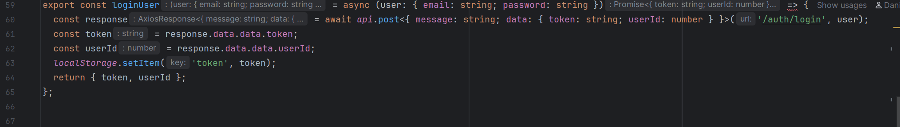
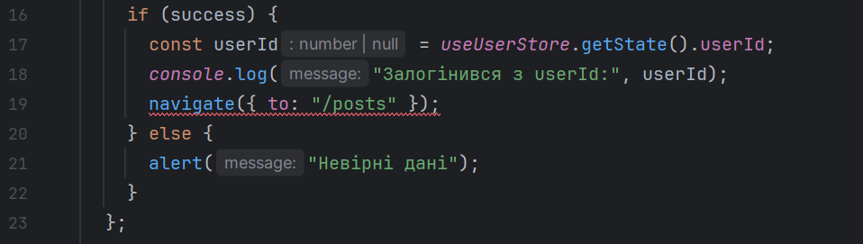

<h2>1. Налаштування змінних оточення:</h2>

-   У корені проєкту створити файл .env
-   Додати до нього такі змінні:
-   Реалізувати використання цих змінних у конфігурації Axios

<h2>2. Створити конфігурацію Axios:</h2>

-   Створити окремий файл (наприклад, src/api/axios.ts)
-   Налаштувати базовий baseURL, заголовок Content-Type, токен авторизації:
-   Реалізувати обробку помилок через інтерцептор (наприклад, логування у консоль або показ повідомлення)

<h2>3. Замінити мок-функції на реальні HTTP-запити:</h2>

У файлі з API-функціями (src/api/posts.ts або аналогічному) замінити реалізацію:
-   getAllEntities() → GET /posts
-   getEntityById(id) → GET /posts/:id
-   createEntity(data) → POST /posts
-   updateEntity(id, data) → PUT /posts/:id
-   deleteEntity(id) → DELETE /posts/:id

    Повернення типізованих відповідей із Axios бажане

<h2>4. [Опціонально, для підвищення оцінки] Реалізувати UI для логіну:</h2>

Створити окрему сторінку логіну (/login)
-   Додати форму з полями email та password
-   При сабміті відправляти POST /auth/login, отримувати JWT
-   Зберігати токен у localStorage або sessionStorage
-   Налаштувати Axios для використання збереженого токена
-   Після успішного логіну — редирект на /posts

    У базовому варіанті допускається використання токена зі змінної оточення без UI логіну.

