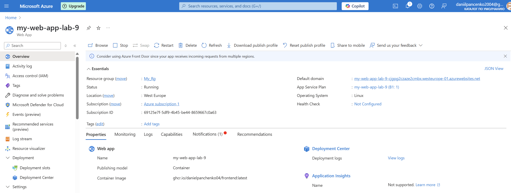
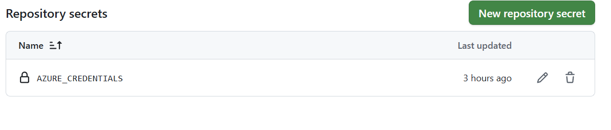
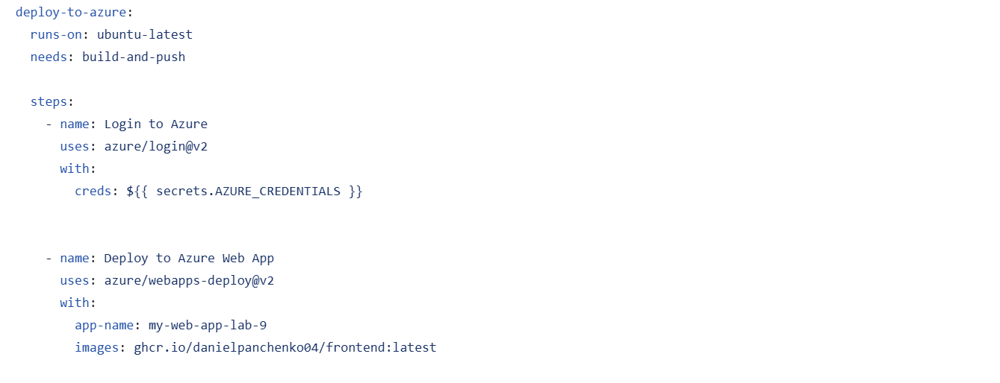
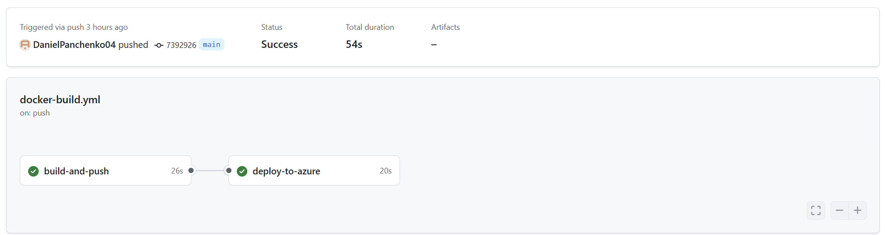
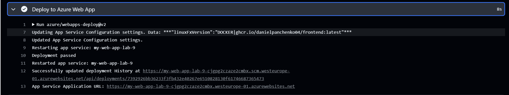
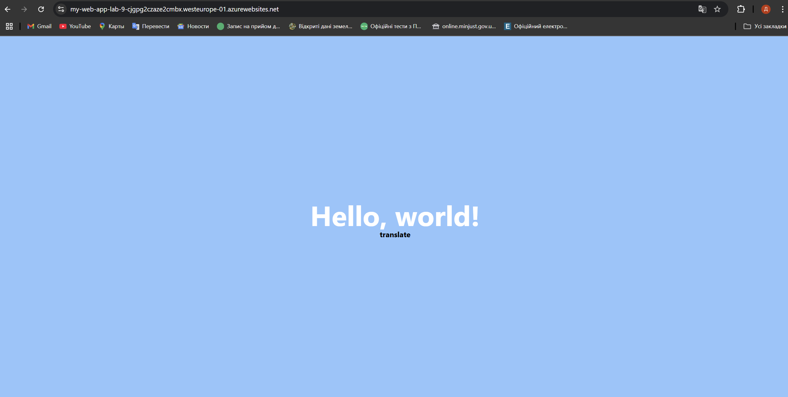

<h2>1. Створити Azure App Service у власній підписці Azure:</h2>

-   a. Створити ресурсну групу (resource group)
-   b. Створити всередині ресурсної групи App Servicе. При створенні вибрати деплой контейнеру замість коду

<h2>2. Створити у Azure Service principal, який буде використовуватись для доступу GitHub до вашої підписки Azure:</h2>

-   в порталі Azure праворуч від рядка пошуку натисніть на значок з зображенням командного рядка
-   оберіть bash
-   при виборі App Service Plan оберіть план Free
-   виконайте наступну команду, замінивши subscription_id на ідентифікатор підписки, а resource_group_name на назву створеної вами ресурсної групи:
    -   az ad sp create-for-rbac --name "myApp" --role contributor --scopes/subscriptions/<subscription_id>/resourceGroups/<resource_group_name> --json-auth

-   Ідентифікатор підписки можна знайти, ввівши в рядок пошуку subscriptions, перейшовши в список підписок і знайшовши там свою(скоріше за все вона буде єдиною), після того як ви клацнете на  неї в загальній інформації скопіюйте subscription_id

-   Після того як команду будет виконано, скопіюйте весь консольний вивід, що матиме таку структуру:
    1. {
    2. "clientId": "<GUID>",
    3. "clientSecret": "<GUID>",
    4. "subscriptionId": "<GUID>",
    5. "tenantId": "<GUID>",
    6. (...)
    7. }

    Отримав відповідь у консоль

<h2>3. Поверніться до вашого github-репозиторію. Перейдіть в settings -> secrets and variables -> actions, та натисніть New Repository Secret. В полі Name введіть AZURE_CREDENTIALS а в поле Secret скопіюйте повністю вивід команди з пункту 2е. Слідкуйте за тим щоб в кінці секрету на було пробілу або переходу рядка, натисніть Add Secret</h2>

<h2>4. Додати нову job в ваш github workflow, створений на попередньому занятті. В неї додати наступні степи:</h2>

-   Логін в Azure з посиланням на секрет в якому зберігаються дані для доступу
    1. - uses: azure/login@v2
    2. with:
    3. creds: ${{ secrets.AZURE_CREDENTIALS }}
-   Деплой в Azure App Service. Замініть <app_service_name> на назву створеного вами app service
    1. - name: Deploy to Azure Web App
    2. uses: azure/webapps-deploy@v2
    3. with:
    4. app-name: <app_service_name>
    5. images: ghcr.io/${{ github.repository_owner }}/${{ github.event.repository.name }}:latest

<h2>5. Запустіть воркфлоу та пересвідчиться що він завершився успішно.</h2>

<h2>6. В логах степу Deploy to Azure Web App знайдіть рядок який починається з App Service Application Url та клікніть по посиланню. Ви маєте побачити веб сторінку з Вашим фронт-ендом. Якщо сторінку не видно – почекайте кілька хвилин та поверніться</h2>

